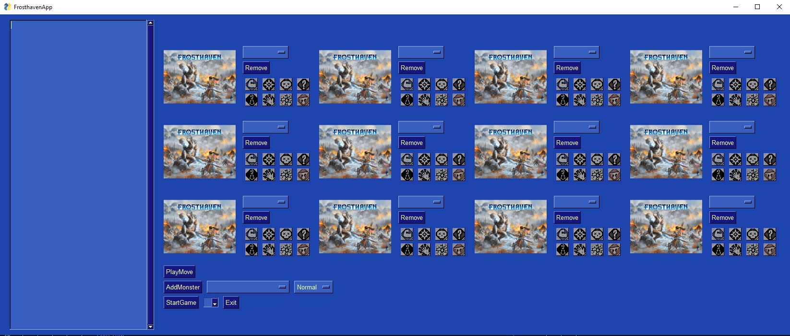

# Example Package

This is a simple example package. You can use
[Github-flavored Markdown](https://guides.github.com/features/mastering-markdown/)
to write your content.

# Prerequisites
1. Python >= 3.7
2. PySimpleGui (pip install PySimpleGui)
3. NumPy (pip install numpy)

# Installation
1. git clone git@github.com:bsanders2/FrosthavenApp.git
2. Navigate to the FrosthavenApp directory
3. Use pip to install the package 
    - $ python -m pip install .
4. Start the GUI with the entrypoint "play"
    - $ play

# Using the GUI
