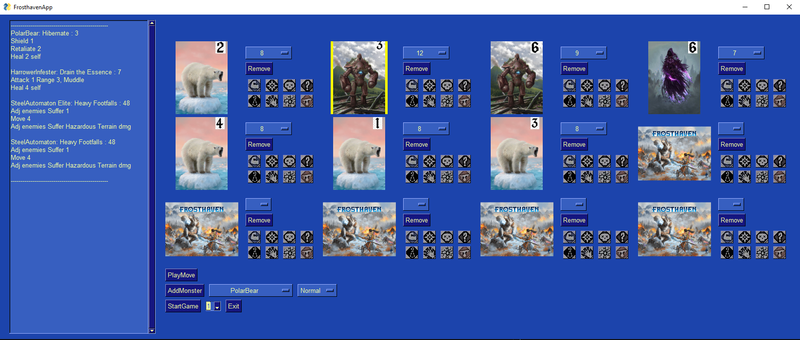

# Example Package

This is a simple example package. You can use
[Github-flavored Markdown](https://guides.github.com/features/mastering-markdown/)
to write your content.

# Prerequisites
1. Python >= 3.7
2. PySimpleGui (pip install PySimpleGui)
3. NumPy (pip install numpy)

# Installation
1. git clone git@github.com:bsanders2/FrosthavenApp.git
2. Navigate to the FrosthavenApp directory
3. Use pip to install the package 
    - $ python -m pip install .
4. Start the GUI with the entrypoint "play"
    - $ play

# Using the GUI

- First set the level of the scenario using the field next to the StartGameButton
- To add a monster, select the monster from the drop down next to the AddMonster button. Select Normal or Elite. Then click AddMonster
    - The standee number of the monster will be selected for you and appear on the image
- The PlayMove button will draw cards and calculate move and attack values for each monster on the board
- You can track conditions on the monsters by clicking the corresponding buttons to the right of the monster image
- You can record damage on the monster by selecting their current health from the drop down next to the monster image
- When a monster reaches 0 health you can remove it by clicking the remove button

# Features implemented so far
- Attack modifier card management
    - Automatic deck shuffling
    - Pulling cards for active monsters
- Calculating attack and move values based on scenario level
    - Elite vs. Non-Elite
- Monster health and conditions book keeping helper
